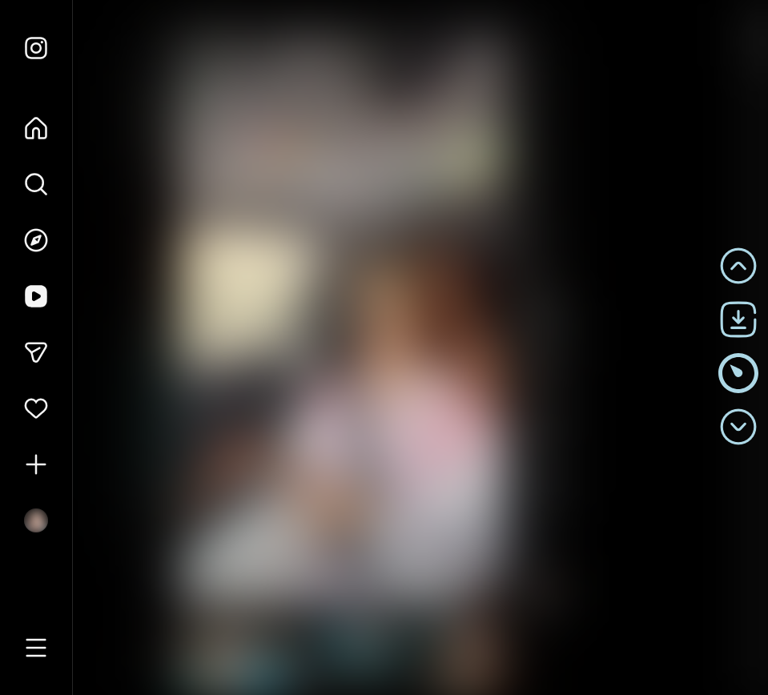

</img>

# Instagram Reels Helper

    
    

## Features

- Playback speed
- Video downloading

## Installation:

###  [Chrome Web Store](https://chrome.google.com/webstore/detail/ainljmjbmkiophfkobhlpolkmmkeapkd)
###  [Firefox Extension Workshop](https://addons.mozilla.org/addon/reels-helper/)

### Chrome (dev):
  1. Download `.zip`.
  2. Unpack the `src` folder to a convenient location.
  3. `⋮` > "Additional tools" > "Extensions".
  4. Turn on "Developer Mode".
  5. Press "Load unpacked extension".
  6. Select the path to the `src` folder.

#### 💲Donate

<table>
  <tr>
    <td>
       
    </td>
    <td>
      <a href="https://donatello.to/super_zombi">Donatello</a>
    </td>
  </tr>
  <tr>
    <td>
       
    </td>
    <td>
      <a href="https://www.donationalerts.com/r/super_zombi">Donation Alerts</a>
    </td>
  </tr>
</table>
